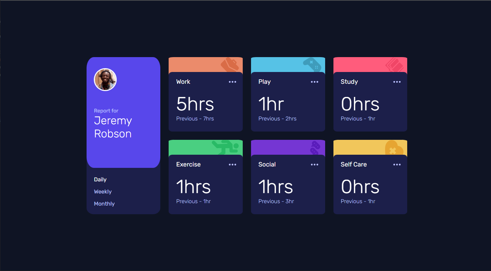

# Frontend Mentor - Time tracking dashboard solution

This is a solution to the [Time tracking dashboard challenge on Frontend Mentor](https://www.frontendmentor.io/challenges/time-tracking-dashboard-UIQ7167Jw). Frontend Mentor challenges help you improve your coding skills by building realistic projects. 

## Table of contents

- [Overview](#overview)
  - [The challenge](#the-challenge)
  - [Screenshot](#screenshot)
  - [Links](#links)
- [My process](#my-process)
  - [Built with](#built-with)
  - [What I learned](#what-i-learned)
  - [Continued development](#continued-development)
  - [Useful resources](#useful-resources)
- [Author](#author)
- [Acknowledgments](#acknowledgments)

**Note: Delete this note and update the table of contents based on what sections you keep.**

## Overview

### The challenge

Users should be able to:

- View the optimal layout for the site depending on their device's screen size
- See hover states for all interactive elements on the page
- Switch between viewing Daily, Weekly, and Monthly stats

### Screenshot

### Links

- Solution URL: [https://github.com/jtran217/TrackingDashboard]
- Live Site URL: [https://jtran217.github.io/TrackingDashboard/]
## My process

### Built with

- Semantic HTML5 markup
- CSS custom properties
- Flexbox
- CSS Grid

### What I learned

-Learned how to better use the display property to trigger certain content to be shown when clicked
-A little more comfortable adjusting flex properties to achieve wanted layout. 

### Continued development
-Want to reinforce grid properties.
-Cleaner code when trying to switch between mobile and desktop design.

### Useful resources

- [https://www.youtube.com/watch?v=rg7Fvvl3taU&t=834s&ab_channel=KevinPowell] - This helped me get the initial layout of the grid, and will definitly be refer back to it when using grid in future projects..

## Author
- Frontend Mentor - [https://www.frontendmentor.io/profile/jtran217]